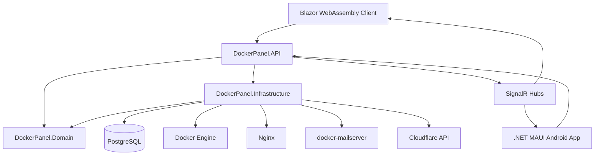

# DockerPanel / ApiHub

DockerPanel, tek bir Linux (Ubuntu/Debian) sunucusu üzerinde Docker container'larını, native web projelerini, domain/DNS yönlendirmelerini, PostgreSQL veritabanlarını, e-posta hesaplarını, yedekleri ve canlı metrikleri yönetmek için geliştirilmiş bir ASP.NET Core + Blazor WebAssembly kontrol panelidir.

Uygulama web tarafında **DockerPanel**, mobil paketlemede ise **ApiHub** adını kullanır.

## Projenin Amacı

Bu projenin amacı, küçük ve orta ölçekli bir VDS/VPS sunucusunu cPanel benzeri tek bir yönetim panelinden kontrol edilebilir hale getirmektir. Hedef; Docker container'ları, native web uygulamaları, domain/DNS kayıtları, Nginx proxy kuralları, SSL sertifikaları, PostgreSQL veritabanları, e-posta hesapları, yedekler ve sunucu loglarını ayrı ayrı terminalden yönetmek yerine güvenli bir web arayüzü ve mobil uygulama üzerinden merkezi olarak yönetmektir.

Panel özellikle tek sunucuda birden fazla web projesi barındırmak, bu projeleri hızlı deploy etmek, kaynak limitlerini izlemek, domainleri yayına almak, e-posta ve veritabanı ihtiyaçlarını aynı sistemden çözmek ve VDS taşıma/kurtarma sürecini otomatikleştirmek için tasarlanmıştır.

## Ne İşe Yarar?

- Docker container projeleri oluşturur, başlatır, durdurur, yeniden başlatır ve limitlerini günceller.
- ZIP ile yüklenen native .NET/Node/static projeleri host üzerinde çalıştırır.
- Nginx reverse proxy konfigürasyonlarını ve Let's Encrypt SSL işlemlerini yönetir.
- Cloudflare veya yerel DNS kayıtlarını panelden kontrol eder.
- PostgreSQL veritabanı ve kullanıcı oluşturma/silme işlemlerini yapar.
- docker-mailserver e-posta hesaplarını ve entegre webmail ekranını sağlar.
- Sistem durumu, container/native proje metrikleri ve loglarını SignalR ile canlı gösterir.
- Audit log, backup/restore, uzak VDS yedek eşitleme, firewall ve mobil bildirim modüllerini içerir.

## Mimari

Proje Clean Architecture yaklaşımına yakın, katmanlı bir yapıyla ayrılmıştır.



### Katmanlar

| Proje | Görev |
| --- | --- |
| `src/DockerPanel.Domain` | Entity, enum, DTO ve servis interface tanımları. Dış katmanlara bağımlı değildir. |
| `src/DockerPanel.Infrastructure` | EF Core `DockerPanelDbContext`, migration'lar ve Docker/Nginx/PostgreSQL/Mail/Cloudflare servis implementasyonları. |
| `src/DockerPanel.API` | ASP.NET Core Web API, JWT auth, controller'lar, SignalR hub, health check, rate limit, background worker'lar ve Blazor WASM hosting. |
| `src/DockerPanel.Client` | MudBlazor tabanlı Blazor WebAssembly panel arayüzü. |
| `src/DockerPanel.Mobile` | .NET MAUI Blazor Hybrid Android uygulaması. Web client'ı mobil kabuk içinde kullanır ve push/deep link/auto update servisleri ekler. |

## Klasör Yapısı

```text
.
|-- DockerPanel.sln
|-- docker-compose.yml
|-- README.md
|-- docs/
|   |-- AGENTS.md
|   |-- ARCHITECTURE.md
|   |-- RECOVERY_GUIDE.md
|   |-- MULTIDOMAIN_PLAN.md
|   |-- implementation_plan.md
|   `-- mobil uygulama.md
|-- scripts/
|   `-- project-manager.sh
`-- src/
    |-- DockerPanel.API/
    |   |-- Controllers/
    |   |-- Helpers/
    |   |-- Hubs/
    |   |-- Workers/
    |   |-- appsettings.json
    |   `-- Program.cs
    |-- DockerPanel.Client/
    |   |-- Layout/
    |   |-- Pages/
    |   |-- Security/
    |   |-- Services/
    |   `-- wwwroot/
    |-- DockerPanel.Domain/
    |   |-- Entities/
    |   |-- Enums/
    |   |-- Interfaces/
    |   `-- Security/
    |-- DockerPanel.Infrastructure/
    |   |-- Data/
    |   |-- Migrations/
    |   `-- Services/
    `-- DockerPanel.Mobile/
        |-- Platforms/Android/
        |-- Security/
        |-- Services/
        |-- Resources/
        `-- wwwroot/
```

## Ana Modüller

### API

`DockerPanel.API` hem REST API'yi hem de Blazor WebAssembly dosyalarını host eder. Uygulama başlarken:

- `appsettings.Local.json` varsa yükler.
- PostgreSQL için `DockerPanelDbContext` kaydeder.
- Migration'ları otomatik çalıştırır.
- `DatabaseSyncHelper` ile mevcut `projects.conf` ve Nginx vhost kayıtlarını veritabanıyla eşitlemeye çalışır.
- JWT, CORS, rate limiting, health check, SignalR ve static file pipeline'ını kurar.

Önemli endpoint grupları:

| Alan | Route |
| --- | --- |
| Auth | `api/auth` |
| Projeler | `api/projects` |
| Nginx/Subdomain | `api/nginx` |
| Root domain | `api/domains/roots` |
| DNS | `api/dns` |
| Veritabanı | `api/databases` |
| Mail/Webmail | `api/mail` |
| Backup/Restore | `api/backups` |
| Firewall | `api/firewall` |
| Audit log | `api/audit-logs` |
| Mobil cihazlar | `api/devices` |
| Bildirimler | `api/notifications` |
| APK indirme | `api/downloads` |
| Sistem durumu | `api/system` |
| Health check | `api/health` |
| SignalR | `/hubs/metriclog` |

### Infrastructure

`DockerPanel.Infrastructure` sunucu operasyonlarının ana uygulama katmanıdır.

| Servis | Sorumluluk |
| --- | --- |
| `ProjectContainerService` | Docker Engine ile container oluşturma, başlatma, durdurma, log ve metrik işlemleri. |
| `ProjectZipDeployService` | ZIP dosyasını güvenli şekilde açma ve native/static proje deploy akışı. |
| `ProcessManagerService` | Host üzerindeki native projeleri `project-manager.sh` üzerinden yönetme. |
| `NginxProxyService` | Vhost dosyası yazma, nginx test/reload, SSL ve rollback akışları. |
| `DatabaseService` | PostgreSQL veritabanı/kullanıcı oluşturma, keşfetme, import ve silme işlemleri. |
| `MailService` | docker-mailserver hesapları, Maildir okuma/yazma, webmail gönderme/silme/okundu akışları. |
| `CloudflareService` | Cloudflare DNS kayıtlarını listeleme, oluşturma ve güncelleme. |
| `BackupService` | Lokal yedek, restore, uzak VDS SSH eşitleme ve public key yönetimi. |
| `FirewallService` | UFW kural listeleme, ekleme, silme ve aktif/pasif yönetimi. |
| `AuditLogService` | Kullanıcı işlemlerinin audit log olarak saklanması. |
| `PushNotificationService` | Mobil cihaz token'ları ve Firebase push bildirimleri. |

### Client

`DockerPanel.Client`, MudBlazor tabanlı SPA'dir. Sayfalar:

- `/` dashboard
- `/containers`
- `/deploy-wizard`
- `/domains`
- `/databases`
- `/email`
- `/webmail`
- `/backups`
- `/firewall`
- `/terminal`
- `/audit-logs`
- `/devices`
- `/notifications`
- `/settings`
- `/guide`
- `/login`

JWT token `JwtAuthenticationStateProvider` ve `JwtAuthorizationHandler` ile yönetilir. API istekleri uygulamanın kendi base adresine gider; API ve Client aynı ASP.NET Core host altında çalışır.

### Mobile

`DockerPanel.Mobile`, Android hedefli .NET MAUI Blazor Hybrid uygulamasıdır. Client DLL'ini derleme sırasında referanslar ve mobil için şu ekleri sağlar:

- Secure token saklama
- Push token kaydı
- Firebase Messaging
- Deep link
- Otomatik güncelleme kontrolü
- Android shortcut ve network security ayarları

## Veri Modeli

Ana tablolar `DockerPanelDbContext` içinde tanımlıdır:

- `Users`
- `Projects`
- `Subdomains`
- `RootDomains`
- `DnsRecords`
- `DatabaseSchemas`
- `MailAccounts`
- `AuditLogs`
- `DeviceTokens`
- `PushNotifications`

Önemli constraint'ler:

- `Users.Username` unique.
- `Projects.Name` unique.
- `Subdomains.SubdomainName + DomainName` unique.
- `RootDomains.Name` unique.
- `DatabaseSchemas.DbName` ve `DbUser` unique.
- `MailAccounts.EmailAddress` unique.
- Kullanıcıya bağlı ana kayıtlarda cascade delete kullanılır.

## Gereksinimler

Yerel geliştirme için:

- .NET SDK 8
- PostgreSQL 16 veya Docker ile PostgreSQL
- Docker Desktop veya Linux Docker Engine
- EF Core tooling gerekiyorsa `dotnet-ef`

Linux production için:

- Ubuntu (20.04/22.04/24.04 LTS) veya Debian (11/12)
- Docker ve Docker Compose
- Nginx
- .NET 8 Runtime veya SDK
- Certbot
- UFW
- `sshpass` sadece şifre tabanlı uzak yedekleme kullanılacaksa gerekir

## Yerel Çalıştırma

1. PostgreSQL'i başlatın.

   ```powershell
   docker compose up -d db
   ```

2. Lokal ayar dosyasını oluşturun.

   `src/DockerPanel.API/appsettings.Local.json` git'e eklenmez. Secret ve lokal connection string değerlerini burada tutun.

   ```json
   {
     "ConnectionStrings": {
       "DefaultConnection": "Host=localhost;Port=5432;Database=dockerpanel_db;Username=dp_admin;Password=YOUR_PASSWORD;Include Error Detail=true",
       "MasterPostgresConnection": "Host=localhost;Port=5432;Database=postgres;Username=dp_admin;Password=YOUR_PASSWORD;Include Error Detail=true"
     },
     "JwtSettings": {
       "SecretKey": "CHANGE_ME_MINIMUM_32_CHARACTERS_SECRET",
       "Issuer": "DockerPanelAPI",
       "Audience": "DockerPanelClient"
     }
   }
   ```

3. Çözümü derleyin.

   ```powershell
   dotnet build DockerPanel.sln
   ```

4. API projesini çalıştırın.

   ```powershell
   dotnet run --project src/DockerPanel.API/DockerPanel.API.csproj
   ```

5. Tarayıcıda açın.

   - HTTP: `http://localhost:5084`
   - HTTPS profili kullanılıyorsa: `https://localhost:7137`
   - Swagger sadece Development ortamında: `/swagger`

> Development ortamında `MetricBackgroundWorker` ve `BackupWorker` kapalı tutulur. Bu, yerel Windows ortamında Docker/Linux servislerine bağlanmaya çalışırken gereksiz timeout hatalarını azaltır.

## Migration ve Veritabanı

Migration'lar `DockerPanel.Infrastructure` projesinde tutulur, runtime'da API tarafından uygulanır.

Yeni migration eklemek için:

```powershell
dotnet ef migrations add MigrationAdi `
  --project src/DockerPanel.Infrastructure `
  --startup-project src/DockerPanel.API
```

Veritabanını elle güncellemek için:

```powershell
dotnet ef database update `
  --project src/DockerPanel.Infrastructure `
  --startup-project src/DockerPanel.API
```

## Production Mimarisi

Production kurulumda API normalde host üzerinde kısıtlı yetkili `dockerpanel_api` kullanıcısı ile systemd servisi olarak çalışır. DockerPanel; Docker socket, Nginx, Certbot, UFW ve `project-manager.sh` gibi host kaynaklarına sadece izin verilen komutlarla erişir.

Tipik sunucu dizinleri:

```text
/opt/dockerpanel/
|-- projects/
|-- backups/
|-- mail/
|   |-- data/
|   |-- state/
|   `-- config/
|-- nginx-template.conf
`-- remote_id_rsa

/etc/project-manager/projects.conf
/var/log/project-manager/
/usr/local/bin/project-manager.sh
/etc/nginx/sites-available/
/etc/nginx/sites-enabled/
```

`scripts/project-manager.sh`, native projeleri başlatmak/durdurmak için kullanılır. Script:

- Proje adlarını `^[a-z0-9_-]+$` formatıyla sınırlar.
- `/etc/project-manager/projects.conf` kayıtlarını okur.
- PID dosyalarını `/run/project-manager` altında tutar.
- Logları `/var/log/project-manager` altına yazar.
- Fiziksel silme işlemini sadece `/opt/dockerpanel/projects/` altında yapar.

Production systemd örneği:

```ini
[Unit]
Description=DockerPanel API
After=network.target

[Service]
WorkingDirectory=/opt/dockerpanel/api
ExecStart=/usr/bin/dotnet DockerPanel.API.dll
Restart=always
RestartSec=10
User=dockerpanel_api
Environment=ASPNETCORE_ENVIRONMENT=Production
Environment=ASPNETCORE_URLS=http://localhost:5000

[Install]
WantedBy=multi-user.target
```

## Güvenlik Notları

- `appsettings.Local.json` secret dosyasıdır ve git'e eklenmemelidir.
- `JwtSettings:SecretKey` production'da mutlaka güçlü ve benzersiz olmalıdır.
- PostgreSQL portu production'da dış dünyaya açılmamalıdır.
- API kullanıcısı root olarak çalıştırılmamalıdır.
- Sudoers yetkisi sadece gerekli komutlarla sınırlanmalıdır: nginx test/reload, certbot, `project-manager.sh`, UFW ve ihtiyaç duyulan kontrollü operasyonlar.
- ZIP deploy akışında Zip Slip koruması korunmalıdır.
- Sistem komutu, dosya yolu, container/proje adı ve SQL identifier alanlarında mevcut input validasyonları gevşetilmemelidir.

## Yedekleme ve Kurtarma

Backup modülü şu bileşenleri kapsar:

- PostgreSQL dump
- `/opt/dockerpanel/projects`
- Nginx vhost dosyaları
- Maildir ve docker-mailserver konfigürasyonu
- Uzak VDS eşitleme
- SSH public key oluşturma/test etme

Detaylı VDS taşıma ve restore akışı için:

- `docs/RECOVERY_GUIDE.md`

## Mobil APK

Android APK publish için MAUI workload ve Android SDK/JDK gerekir.

Örnek publish:

```powershell
dotnet publish src/DockerPanel.Mobile/DockerPanel.Mobile.csproj `
  -f net8.0-android `
  -c Release
```

Mobil proje Firebase Messaging kullandığı için `src/DockerPanel.Mobile/Platforms/Android/google-services.json` ortama göre doğru değerlerle hazır olmalıdır.

## Dokümanlar

- `docs/ARCHITECTURE.md`: Kod tabanlı detaylı mimari rehber.
- `docs/AGENTS.md`: İş mantığı, servis algoritmaları ve ajan geliştirme talimatları.
- `docs/RECOVERY_GUIDE.md`: Tek komutla VDS taşıma ve disaster recovery rehberi.
- `docs/MULTIDOMAIN_PLAN.md`: Çoklu root domain ve domain bazlı Cloudflare planları.
- `docs/implementation_plan.md`: Kapsam ve faz bilgileri.
- `docs/mobil uygulama.md`: Mobil uygulama, APK dağıtımı ve bildirim planları.

## Geliştirme Kuralları

- Yeni entity ve interface tanımları `DockerPanel.Domain` altına eklenmelidir.
- Dış sistem entegrasyonları `DockerPanel.Infrastructure.Services` altında uygulanmalıdır.
- API dependency injection kayıtları `src/DockerPanel.API/Program.cs` içinde yapılmalıdır.
- API route şekli mevcut `/api/...` sözleşmesi korunarak genişletilmelidir.
- Blazor UI'da mevcut MudBlazor ve `AppState` desenleri takip edilmelidir.
- EF Core sorgularında aynı `DbContext` içinde paralel `Task.WhenAll` kullanımından kaçınılmalıdır.
- Production davranışı kontrol edilirken paneldeki durum yazısından önce gerçek Docker/Nginx/process durumu doğrulanmalıdır.

## Sık Kullanılan Komutlar

```powershell
# Tüm çözümü derle
dotnet build DockerPanel.sln

# API + Blazor host çalıştır
dotnet run --project src/DockerPanel.API/DockerPanel.API.csproj

# Migration ekle
dotnet ef migrations add MigrationAdi --project src/DockerPanel.Infrastructure --startup-project src/DockerPanel.API

# Veritabanını güncelle
dotnet ef database update --project src/DockerPanel.Infrastructure --startup-project src/DockerPanel.API

# Android APK publish
dotnet publish src/DockerPanel.Mobile/DockerPanel.Mobile.csproj -f net8.0-android -c Release
```

