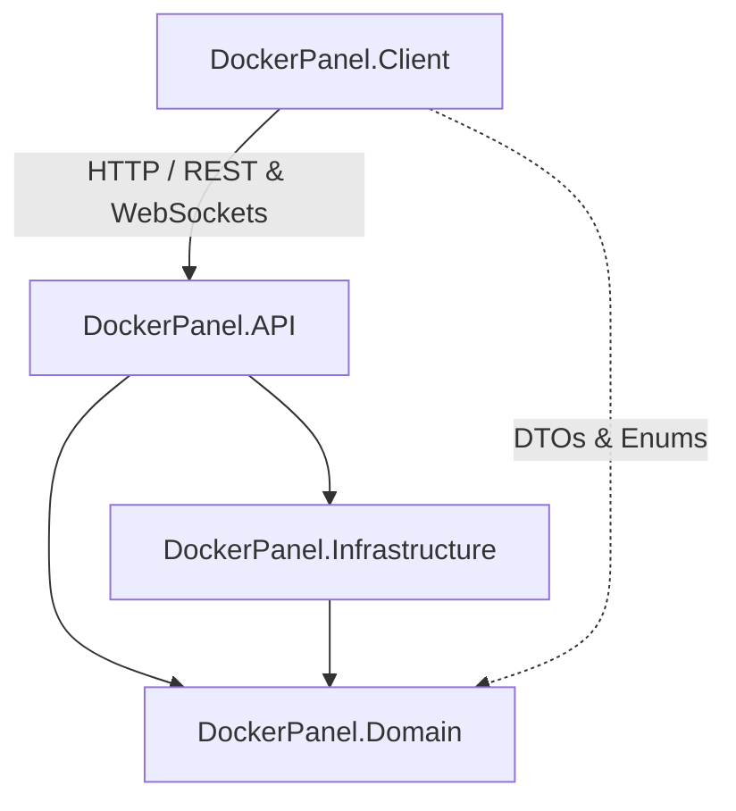

# DockerPanel Mimari & Ajan Entegrasyon Kılavuzu (ARCHITECTURE.md)

Bu döküman, DockerPanel platformunda (ASP.NET Core Web API ve Blazor WebAssembly) çalışacak Yapay Zeka Ajanları (Agent) ve geliştiriciler için **kod tabanlı, somut ve teknik** bir sistem mimarisi kılavuzudur. `AGENTS.md` belgesindeki yüksek seviyeli iş gereksinimlerinin kod seviyesindeki yansımalarını gösterir.

---

## 1. Çözüm (Solution) Katmanları ve Klasör Yapısı
DockerPanel projesi, **Temiz Mimari (Clean Architecture)** prensiplerine göre yapılandırılmış 4 ana katmandan oluşmaktadır:

| Katman | Proje Dosyası | Sorumluluk & İçerik | Bağımlılıklar |
| :--- | :--- | :--- | :--- |
| **Domain** | [DockerPanel.Domain.csproj](file:///c:/Users/sahin/Desktop/cpanelproje/src/DockerPanel.Domain/DockerPanel.Domain.csproj) | Varlıklar (Entities), Sayım Tipleri (Enums), Servis Arayüzleri (Interfaces) ve Sistem Günlük Kapsülleri. | *Hiçbir katmana bağımlı değildir.* |
| **Infrastructure** | [DockerPanel.Infrastructure.csproj](file:///c:/Users/sahin/Desktop/cpanelproje/src/DockerPanel.Infrastructure/DockerPanel.Infrastructure.csproj) | EF Core `DockerPanelDbContext`, Veritabanı Göçleri (Migrations) ve Dış Servis (Docker API, PostgreSQL, Nginx, Cloudflare vb.) gerçekleştirmeleri. | `Domain` |
| **API** | [DockerPanel.API.csproj](file:///c:/Users/sahin/Desktop/cpanelproje/src/DockerPanel.API/DockerPanel.API.csproj) | REST API Uç Noktaları (Controllers), Kimlik Doğrulama Yardımcıları, SignalR Hubs ve Metrik İzleme Arka Plan İşçisi. | `Infrastructure`, `Domain` |
| **Client** | [DockerPanel.Client.csproj](file:///c:/Users/sahin/Desktop/cpanelproje/src/DockerPanel.Client/DockerPanel.Client.csproj) | Blazor WebAssembly SPA (MudBlazor UI tabanlı), JWT Kimlik Sağlayıcısı ve Sayfalar. | `Domain` (DTO paylaşımları için) |



---

## 2. Veri Tabanı Mimarisi (Entity Framework Core)
Veritabanı ilişkileri ve kısıtlamaları [DockerPanelDbContext.cs](file:///c:/Users/sahin/Desktop/cpanelproje/src/DockerPanel.Infrastructure/Data/DockerPanelDbContext.cs) sınıfında `Fluent API` aracılığıyla yapılandırılmıştır.

### Tablolar ve İlişkiler (Entity Mappings)
- **Users**: Panel yöneticileri ve müşteriler. UUID Primary Key. `Username` üzerinde Unique Index mevcuttur. Role bilgisi String olarak saklanır.
- **Projects**: Hibrit proje tablosudur (`DockerContainer` veya `NativeProject`). `UserId` ile `Users` tablosuna bağlıdır (Cascade Delete). Proje `Name` alanı benzersizdir (Unique Index). Projenin son başlatılma zamanını saklayan `StartedAt` (DateTimeOffset?) ve yerel PHP desteğini belirten `EnablePhp` (bool) kolonlarını barındırır.
- **Subdomains**: Nginx Reverse Proxy kurallarını temsil eder. `SubdomainName` ve `DomainName` alanları birlikte **Unique Index** (`HasIndex(e => new { e.SubdomainName, e.DomainName }).IsUnique()`) oluşturur. Hem `UserId` hem de opsiyonel `ProjectId` ile ilişkili olup Cascade Delete uygulanır.
- **DnsRecords**: Dinamik Cloudflare veya yerel DNS kayıtları. `ZoneID` ve Cloudflare ID (`CloudflareRecordId`) alanlarını barındırır.
- **DatabaseSchemas**: PostgreSQL üzerinde müşteriler için ayrılan izole şemalar. `DbName` ve `DbUser` alanları üzerinde Unique Index mevcuttur.
- **MailAccounts**: docker-mailserver e-posta hesapları. `EmailAddress` benzersizdir (Unique Index).

---

## 3. Temel İş Mantığı ve Servis Gerçekleştirmeleri (Core Services)
Sunucu operasyonlarını yürüten asenkron C# servisleri `DockerPanel.Infrastructure` katmanında yer alır:

### A. Docker Konteyner Yönetimi ([ProjectContainerService.cs](file:///c:/Users/sahin/Desktop/cpanelproje/src/DockerPanel.Infrastructure/Services/ProjectContainerService.cs))
- **Docker Engine Entegrasyonu**: Windows ortamında `npipe://./pipe/docker_engine`, Linux ortamında ise `unix:///var/run/docker.sock` üzerinden asenkron bağlantı sağlar.
- **Güvenli Girdi Kontrolü**: Gelen konteyner isimleri `^[a-z0-9_-]+$` regex filtresinden geçirilir (Komut enjeksiyonunu engellemek amacıyla).
- **İmaj Yönetimi**: İmaj yerelde mevcut değilse, arka planda asenkron olarak Docker Hub'dan çekilir (`CreateImageAsync`).
- **Ağ İzolasyonu**: Oluşturulan tüm konteynerler `dockerpanel-global-net` adlı izole bridge ağına dahil edilir.
- **Canlı Metrik Takibi**: Konteyner istatistikleri (`GetContainerStatsAsync`) 3 saniyelik zaman aşımı ile `Docker.DotNet` stats stream üzerinden tekil (non-stream) olarak okunur.

### B. Süreç Yöneticisi ([ProcessManagerService.cs](file:///c:/Users/sahin/Desktop/cpanelproje/src/DockerPanel.Infrastructure/Services/ProcessManagerService.cs))
- **Çoklu Konu Güvenliği**: Native web projelerinin konfigürasyon dosyası (`projects.conf`) okunup yazılırken `static SemaphoreSlim(1,1)` kilitlemesi (`FileLock`) ile yarış durumları (race conditions) önlenir.
- **Akıllı Başlangıç Komutu Algılama**: Native .NET projelerinde `.runtimeconfig.json` dosyası varlığına bakarak ana yürütülebilir `.dll` dosyasını otomatik tespit eder ve `dotnet ProjectName.dll --urls http://localhost:port` şeklinde başlatır.
- **Sudo Arayüz Tetiklemeleri**: Linux sunucusunda süreçler `sudo /usr/local/bin/project-manager.sh [start|stop|restart|delete] [project_name]` komutlarıyla asenkron alt süreç (Process) olarak yönetilir.

### C. Güvenli ZIP Dağıtımı ([ProjectZipDeployService.cs](file:///c:/Users/sahin/Desktop/cpanelproje/src/DockerPanel.Infrastructure/Services/ProjectZipDeployService.cs))
- **Zip Slip Koruması**: Klasör dışına yazma saldırılarını (Directory Traversal) engellemek amacıyla ZIP içerisindeki her dosyanın mutlak yolu asenkron olarak çözümlenir (`Path.GetFullPath`) ve hedef dizinin tam yoluyla karşılaştırılır:
  ```csharp
  if (!fileFullPath.StartsWith(destinationFullPath, StringComparison.OrdinalIgnoreCase))
  {
      throw new InvalidOperationException("Güvenlik Uyarısı: Zip Slip engellendi!");
  }
  ```

### D. Dinamik PostgreSQL Yönetimi ([DatabaseService.cs](file:///c:/Users/sahin/Desktop/cpanelproje/src/DockerPanel.Infrastructure/Services/DatabaseService.cs))
- **SQL Enjeksiyon Koruması**: Veritabanı ve kullanıcı adları `^[a-zA-Z0-9_]+$` regex denetiminden geçer. Şifre alanı Npgsql parametreleriyle güvenli şekilde işlenir.
- **AutoCommit Bağlantısı**: PostgreSQL mimarisi gereği `CREATE DATABASE` ifadesi bir transaction bloğu içinde çalıştırılamaz. Bu nedenle master veritabanına AutoCommit modunda ayrı bir asenkron bağlantı açılır.
- **Bağlantı Sonlandırma**: Bir veritabanı silinmeden önce aktif bağlantıların tamamı `pg_terminate_backend` sorgusuyla zorla kapatılır:
  ```sql
  SELECT pg_terminate_backend(pg_stat_activity.pid)
  FROM pg_stat_activity
  WHERE pg_stat_activity.datname = @db AND pid <> pg_backend_pid();
  ```

### E. Güvenli Yedekleme ve Uzak VDS SSH Eşitleme ([BackupService.cs](file:///c:/Users/sahin/Desktop/cpanelproje/src/DockerPanel.Infrastructure/Services/BackupService.cs))
- **Hatasız Veritabanı Yedekleme (set -o pipefail):** `pg_dump` başarısızlıklarının (parola uyuşmazlığı, konteyner durması vb.) gzip boru hattında yutulmasını önlemek için yedekleme komutunun başına `set -o pipefail` eklenmiştir. Dump işlemi Docker socket üzerinden doğrudan PostgreSQL konteyneri içinde (`docker exec -i dockerpanel-db pg_dump`) çalıştırılarak sunucu genelindeki versiyon uyumsuzluğu problemleri engellenir.
- **Otomatik SSH Anahtarı Üretimi (VDS Keypair):** Sunucu üzerinde panel için otomatik olarak 4096-bit RSA anahtar çifti oluşturulması sağlanır. Özel anahtar `/opt/dockerpanel/remote_id_rsa` yolunda güvenli bir şekilde saklanır ve SSH protokolünün güvenlik gereksinimleri nedeniyle `chmod 600` yetkilendirmesiyle izole edilir.
- **Çift Yöntemli Kimlik Doğrulama:**
  - **SSH Anahtar Yöntemi:** Panelin otomatik üretilen genel anahtarını (`.pub`) kopyalayıp hedef sunucuya eklemek yeterlidir. Kullanıcı kendi özel anahtarını yapıştırmak isterse (`KeyContent` alanı), bu veri sunucuya güvenli bir şekilde yazılır.
  - **Şifre ile Bağlan (sshpass):** Şifre tabanlı bağlantı tercih edilirse, sistem `sshpass` kontrolü yapar. Eğer sunucuda `sshpass` yüklü değilse, kullanıcıya bunu nasıl kuracağını gösteren açıklayıcı bir hata döner.
- **Anlık Bağlantı Testi (`TestSshConnectionAsync`):** Arayüzden girilen geçici verilerle hedef sunucuya `ssh -o ConnectTimeout=5` el sıkışma komutu gönderilir. Eğer kullanıcı henüz kaydetmediği bir özel anahtarı test ediyorsa, anahtar `/tmp/temp_ssh_key_...` yolunda geçici bir dosyaya yazılır, test edilir ve hemen bellekten silinir.
- **Tek Tıkla Felaket Kurtarma (`restore-all.sh`):** `/opt/dockerpanel/restore-all.sh` adresinde saklanan ve panel arayüzündeki interaktif modal kılavuzdan tek tıkla kopyalanabilen bash scripti; bağımlılıkların kurulmasını, `dockerpanel-global-net` izole ağının ayağa kaldırılmasını, dosyaların yerlerine açılmasını, veritabanının psql konteynerine basılmasını ve Nginx/Let's Encrypt SSL sertifikalarının sıfır veri kaybıyla aktifleşmesini sağlar.

---

## 4. API Katmanı ve Sunucu Mimarisi
[Program.cs](file:///c:/Users/sahin/Desktop/cpanelproje/src/DockerPanel.API/Program.cs) platformun omurgasıdır ve şu kritik mekanizmaları barındırır:

- **Veritabanı Otomatik Göçü (Auto Migration & Sync)**: Uygulama ayağa kalkarken `DbContext.Database.Migrate()` tetiklenir ve sunucudaki yerel `projects.conf` ile Nginx vhost konfigürasyonlarını veritabanı kayıtlarıyla eşleştiren `DatabaseSyncHelper.SyncExistingSystemDataAsync` yardımcı sınıfı çalıştırılır.
- **JWT Yetkilendirmesi**: HMAC SHA256 şifreli anahtarlarla JWT doğrulama altyapısı kuruludur.
- **SignalR & WebSocket JWT Desteği**: Web tarayıcıları WebSocket bağlantılarında HTTP başlığı gönderemedikleri için, SignalR el sıkışma aşamasında token'ı URL query string'den alır (`access_token=...`) ve `OnMessageReceived` olayı ile JwtBearer altyapısına besler.
- **Metrik Arka Plan İşçisi ([MetricBackgroundWorker.cs](file:///c:/Users/sahin/Desktop/cpanelproje/src/DockerPanel.API/Workers/MetricBackgroundWorker.cs))**: Arka planda 3 saniyede bir çalışan işçi, aktif projelerin CPU/RAM verilerini asenkron toplayıp SignalR `MetricLogHub` aracılığıyla `project_[projectId]` grubuna dahil olan istemcilere canlı yayınlar.

---

## 5. Frontend UI Mimarisi (MudBlazor WASM)
İstemci tarafı [DockerPanel.Client.csproj](file:///c:/Users/sahin/Desktop/cpanelproje/src/DockerPanel.Client/DockerPanel.Client.csproj) projesinde toplanmıştır:

- **Durum Yönetimi & JWT Entegrasyonu**: [JwtAuthenticationStateProvider.cs](file:///c:/Users/sahin/Desktop/cpanelproje/src/DockerPanel.Client/Security/JwtAuthenticationStateProvider.cs) tarayıcı yerel depolamasındaki (`localStorage`) JWT token'ı okuyarak Blazor `AuthenticationState` mekanizmasını besler.
- **Otomatik Token Ekleme**: [JwtAuthorizationHandler.cs](file:///c:/Users/sahin/Desktop/cpanelproje/src/DockerPanel.Client/Security/JwtAuthorizationHandler.cs) bir `DelegatingHandler` olarak HttpClient'a kaydedilmiştir. API'ye giden her HTTP isteğine `Authorization: Bearer [token]` başlığını otomatik enjekte eder.
- **Sayfa Düzeni**: Ana şablon [MainLayout.razor](file:///c:/Users/sahin/Desktop/cpanelproje/src/DockerPanel.Client/Layout/MainLayout.razor) ve yan menü [NavMenu.razor](file:///c:/Users/sahin/Desktop/cpanelproje/src/DockerPanel.Client/Layout/NavMenu.razor) MudBlazor bileşenleriyle premium siber-zümrüt ve yakut derinlik renkleriyle şekillendirilmiştir.

---

## 6. Yapay Zeka Ajanları (AI Agents) İçin Geliştirme Kuralları
Bu projede geliştirme yapacak bir AI Ajanının kesinlikle uyması gereken kurallar şunlardır:

1. **Katmanlı Mimariyi Koruyun**:
   - Yeni bir sunucu servis modeli eklerken arayüzü (interface) `DockerPanel.Domain/Interfaces` altına, somut gerçekleştirmeyi `DockerPanel.Infrastructure/Services` altına ekleyin ve `DockerPanel.API/Program.cs` dosyasına kaydedin.
2. **Girdi Güvenliğini Elden Bırakmayın**:
   - Sistem komutlarını tetikleyen (`sudo` orkestrasyonları, dosya yolları, SQL sorguları) parametreleri mutlaka regex (`^[a-z0-9_-]+$`) ile süzün.
   - ZIP dosyası açma işlemlerinde Zip Slip Directory Traversal koruma algoritmalarını harfiyen uygulayın.
3. **Senkron Kilitlemelere Dikkat Edin**:
   - Çoklu ipliklerin (threads) erişebileceği yerel dosya yazma durumlarında `static SemaphoreSlim(1,1)` kullanarak yarış durumlarının önüne geçin.
4. **MudBlazor UI Prensipleri**:
   - Arayüz geliştirmelerinde MudBlazor kütüphanesini kullanın. UI renk şemasında *Indigo* (temel/arka plan), *Siber Zümrüt (Green/Emerald)* (aktif/sağlıklı servisler) ve *Asil Yakut (Red/Ruby)* (hata/durmuş servisler) paletine sadık kalın.
